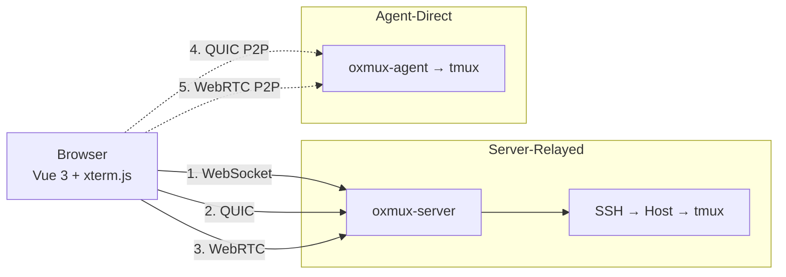

# Oxmux

**Claude Code fleet manager** — manage multiple remote Claude Code sessions from a single browser dashboard. Built with Rust + Vue 3.

[](LICENSE)
[](https://oxmux.app)

## What It Does

Oxmux connects your browser to remote tmux sessions via 5 transport paths. Run Claude Code agents across multiple SSH hosts, see structured AI output, and manage everything from one dashboard.



## 5 Transport Modes

| # | Transport | Data Path | Requires | Best For |
|---|-----------|-----------|----------|----------|
| 1 | **WS → SSH** | Browser → Server → SSH → Host | Nothing extra | Default, works everywhere |
| 2 | **QUIC → SSH** | Browser → Server → SSH → Host | QUIC port open | Low latency, mobile |
| 3 | **WebRTC → SSH** | Browser → Server → SSH → Host | TURN/STUN | NAT traversal to server |
| 4 | **QUIC → Agent** | Browser → Agent (P2P) | Agent installed | Lowest latency |
| 5 | **WebRTC → Agent** | Browser → Agent (P2P) | Agent + TURN | P2P through any NAT |

All transports carry the same binary MessagePack protocol. The SSH/tmux layer is identical.

## Features

| Category | Feature |
|----------|---------|
| **Terminal** | Full xterm.js rendering, tmux session/window/pane tree, resize propagation |
| **Transport** | WebSocket, QUIC (WebTransport), WebRTC DataChannel, COTURN integration |
| **SSH** | Multi-host connections, private key + password + agent auth, auto-reconnect |
| **Claude Code** | stream-json parser, structured conversation UI, tool use blocks, cost meter |
| **Fleet** | Multi-session dashboard, aggregate cost tracking, process auto-detection |
| **Auth** | JWT tokens, user isolation, session persistence (SQLite) |
| **Agent** | Auto-deploy via SSH, QUIC P2P, WebRTC P2P, self-update |

## Tech Stack

| Layer | Technology |
|-------|------------|
| **Server** | Rust, Axum 0.7, Tokio, russh (SSH), quinn (QUIC), SQLite |
| **Client** | Vue 3, Vite, Pinia, xterm.js, TypeScript |
| **Agent** | Rust, quinn (QUIC), portable-pty, tmux control mode |
| **Protocol** | Binary MessagePack over WS/QUIC/WebRTC |
| **WebRTC** | COTURN (HMAC-SHA1 shared secret), ICE, DTLS |
| **Testing** | cargo test, Playwright E2E, k6 load tests |
| **Deploy** | Docker, Kubernetes, acme.sh + Cloudflare DNS |

## Quick Start

```bash
git clone https://github.com/gjovanov/oxmux.git
cd oxmux
cp .env.example .env    # Edit: OXMUX_JWT_SECRET, COTURN_AUTH_SECRET
make dev                # Server (cargo watch) + Client (vite)
```

Open `http://localhost:5173` — register, create an SSH session, connect.

### Docker

```bash
docker compose up
```

## Project Structure

```
oxmux/
├── server/          Rust: Axum HTTP/WS/QUIC server, SSH, session management
├── client/          Vue 3: xterm.js terminal, Claude dashboard, Pinia stores
├── agent/           Rust: lightweight P2P binary for remote hosts
├── e2e/             Playwright E2E + k6 load tests
├── docs/            Architecture, API, UI, deployment, agent docs
└── .github/         CI workflows
```

## Documentation

| Document | Description |
|----------|-------------|
| [Architecture](docs/architecture.md) | System overview, 5 transport diagrams, session lifecycle, module structure |
| [API Reference](docs/api.md) | REST endpoints, WebSocket protocol, QUIC protocol, message types |
| [Frontend](docs/ui.md) | Vue components, Pinia stores, composables, theme |
| [Deployment](docs/deployment.md) | K8s manifests, nginx, SSL, env vars, Docker |
| [Agent](docs/agent.md) | Agent architecture, auto-deploy, QUIC protocol, updates |

## Session Creation

```
New Session:
  Name: [mars1]
  Host: [94.130.141.98]
  User: [gjovanov]
  SSH Key: [~/.ssh/id_secunet]

  Transport:
    Server-relayed:  ○ WebSocket  ○ QUIC  ○ WebRTC
    Agent-direct:    ○ QUIC P2P   ○ WebRTC P2P
```

For server-relayed transports, the server holds the SSH connection. For agent-direct, the oxmux-agent manages tmux locally on the host.

## Scripts

| Command | Description |
|---------|-------------|
| `make dev` | Start server + client dev servers |
| `make dev:server` | Server only (cargo watch) |
| `make dev:client` | Client only (vite) |
| `make test` | Rust unit + integration tests |
| `make test:e2e` | Playwright E2E against production |
| `make test:load` | k6 WebSocket load test |
| `make build` | Release build (server + client) |
| `make build:agent` | Build oxmux-agent binary |

## Deployment

Live at **https://oxmux.app**

See [deployment docs](docs/deployment.md) for K8s setup, or use [oxmux-deploy](https://github.com/gjovanov/oxmux-deploy).

## License

MIT
