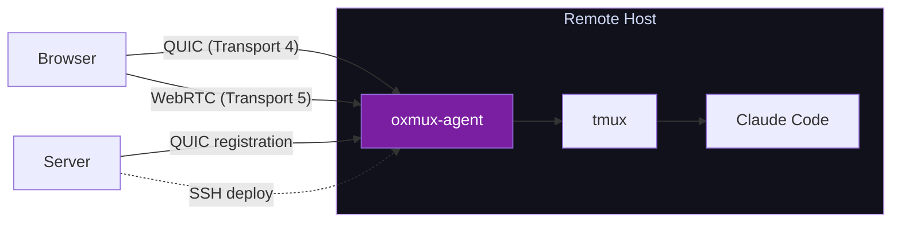
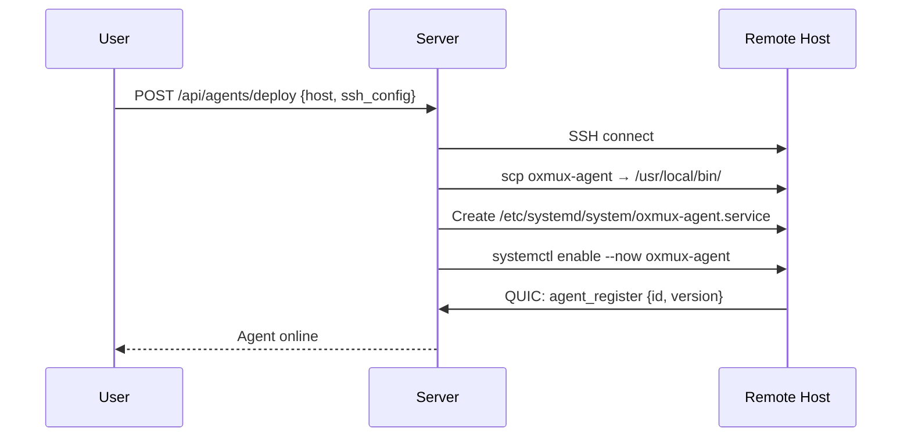
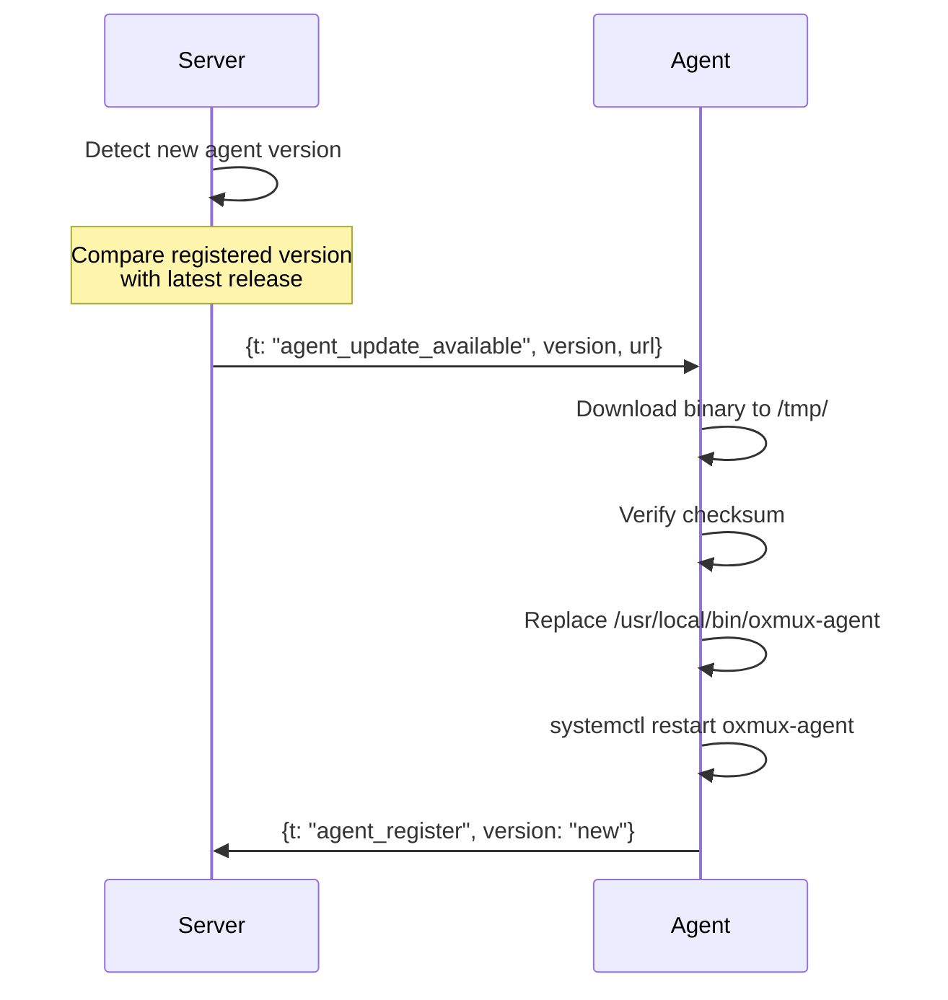

# oxmux-agent

Lightweight binary deployed on remote hosts for direct P2P connections (Transport 4 & 5).

## Overview



## What the Agent Does

- Manages tmux sessions locally (no SSH needed — it runs on the host)
- Exposes a QUIC endpoint for browser or server connections
- Exposes a WebRTC endpoint for browser P2P connections
- Authenticates connections via JWT (shared secret with server)
- Speaks the same MessagePack protocol as the server
- Registers with the server via QUIC heartbeat

## What the Agent Does NOT Do

- No database
- No user management
- No web UI
- No SSH (it IS the target host)

## Installation

### Auto-deploy via Server (recommended)

The server SSHes to the remote host and installs the agent:



### Manual Installation

```bash
# Download binary
curl -fsSL https://github.com/gjovanov/oxmux/releases/latest/download/oxmux-agent-linux-amd64 \
  -o /usr/local/bin/oxmux-agent
chmod +x /usr/local/bin/oxmux-agent

# Configure
cat > /etc/oxmux-agent.env << 'EOF'
AGENT_QUIC_PORT=4433
OXMUX_SERVER=https://oxmux.app
OXMUX_AGENT_SECRET=<shared-secret-from-server>
EOF

# Install systemd service
cat > /etc/systemd/system/oxmux-agent.service << 'EOF'
[Unit]
Description=Oxmux Agent
After=network.target

[Service]
Type=simple
EnvironmentFile=/etc/oxmux-agent.env
ExecStart=/usr/local/bin/oxmux-agent
Restart=always
RestartSec=5
User=root

[Install]
WantedBy=multi-user.target
EOF

systemctl enable --now oxmux-agent
```

## Configuration

| Variable | Default | Description |
|----------|---------|-------------|
| `AGENT_QUIC_PORT` | `4433` | QUIC listener port |
| `OXMUX_SERVER` | — | Server URL for registration |
| `OXMUX_AGENT_SECRET` | — | Shared secret for JWT verification |
| `RUST_LOG` | `oxmux_agent=info` | Log level |

## QUIC Protocol

The agent speaks the same MessagePack protocol as the server:

| Stream | Direction | Content |
|--------|-----------|---------|
| Stream 0 | Bidirectional | Control: auth, session CRUD |
| Stream N | Bidirectional | Per-pane PTY I/O |

### Registration Flow

On startup, the agent connects to the server via QUIC:

```
Agent → Server: {t: "agent_register", agent_id, hostname, version, quic_port}
Server → Agent: {t: "agent_registered", token}

Every 30s:
Agent → Server: {t: "agent_heartbeat", agent_id, uptime, sessions}
Server → Agent: {t: "agent_heartbeat_ack"}
```

### Browser Connection Flow

When a browser connects directly to the agent:

```
Browser → Agent: {t: "auth", token: "<jwt-from-server>"}
Agent → Agent: Verify JWT using shared secret
Agent → Browser: {t: "auth_ok"}

Browser → Agent: {t: "sess_connect", name: "my-session"}
Agent → Agent: tmux new-session / attach
Agent → Browser: {t: "sess_connected", tmux_sessions: [...]}
```

## Updates

### Auto-update via Server



### Manual Update

```bash
# Download and replace
curl -fsSL https://github.com/gjovanov/oxmux/releases/latest/download/oxmux-agent-linux-amd64 \
  -o /usr/local/bin/oxmux-agent
systemctl restart oxmux-agent
```

## Security

| Concern | Mitigation |
|---------|------------|
| Unauthorized connections | JWT auth on every connection |
| Exposed QUIC port | Firewall: allow only server IP + TURN IPs |
| Binary integrity | SHA256 checksum verification on update |
| TLS | Self-signed certs (auto-generated by agent) |
| Privilege escalation | Agent runs as root only if tmux needs it |

## Architecture

```
oxmux-agent binary
├── QUIC listener (quinn)
│   ├── Accept browser connections (Transport 4)
│   ├── Accept server connections (registration)
│   └── TLS with self-signed cert
├── WebRTC listener (Transport 5)
│   ├── ICE candidate gathering
│   ├── DTLS + SRTP
│   └── DataChannel MessagePack
├── tmux manager
│   ├── tmux -CC control mode
│   ├── %output parsing → broadcast
│   └── send-keys for input
└── Registration
    ├── Server QUIC heartbeat (30s)
    └── Version reporting
```
