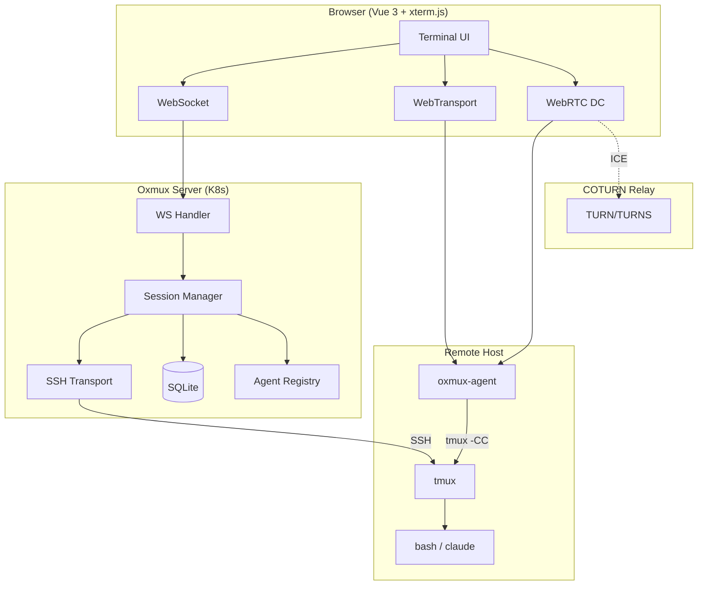
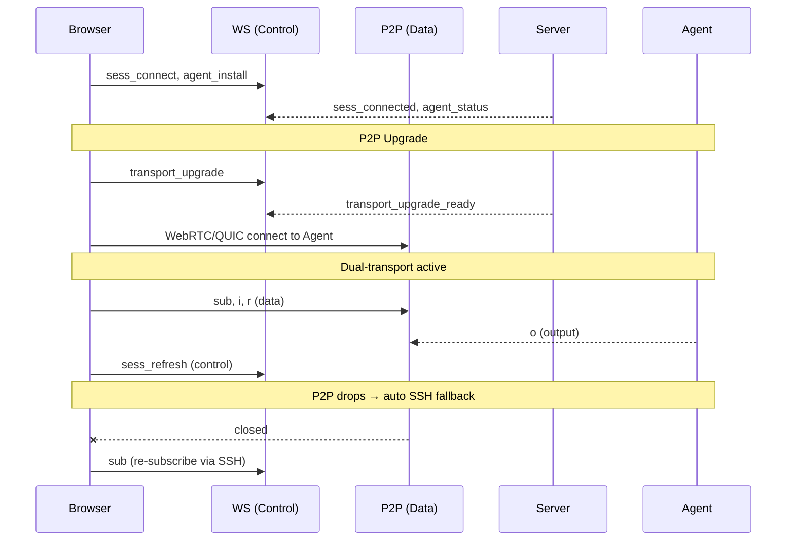
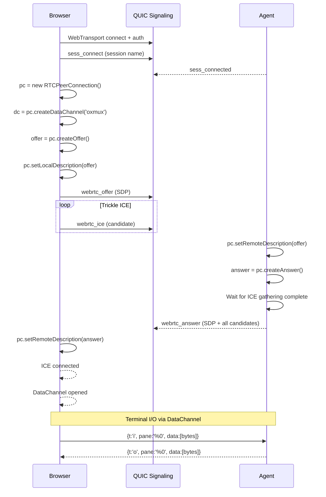
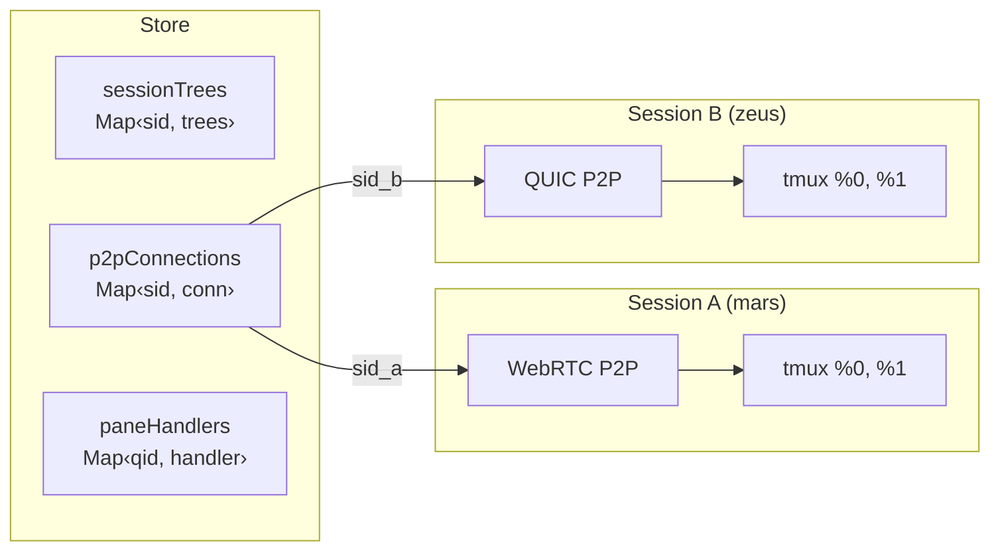
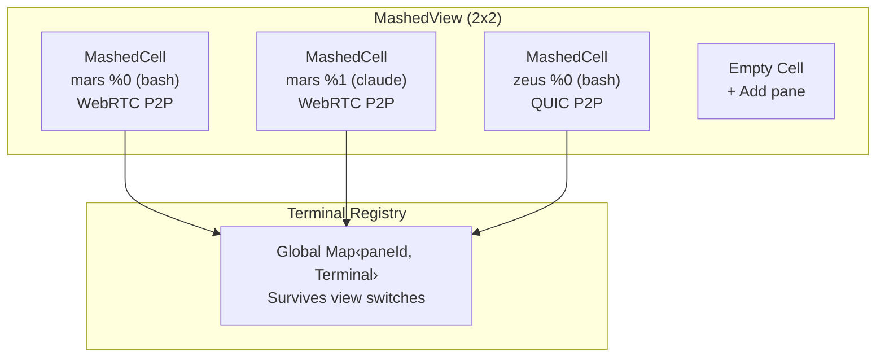
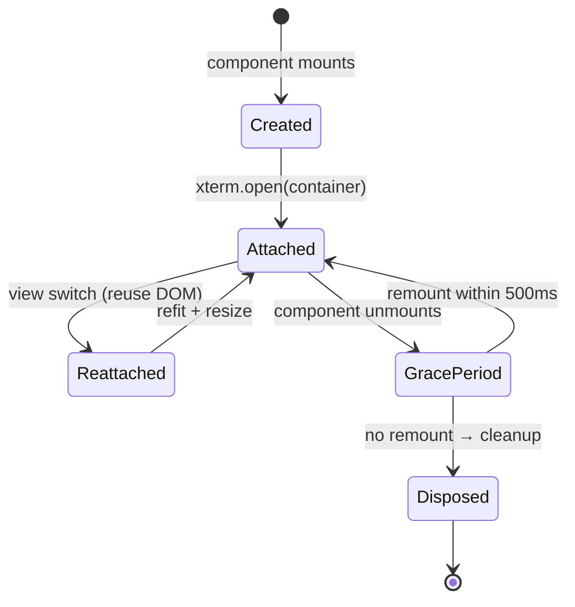
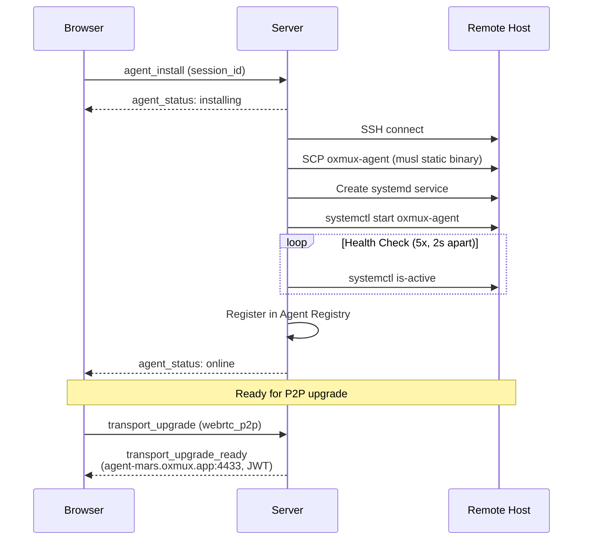
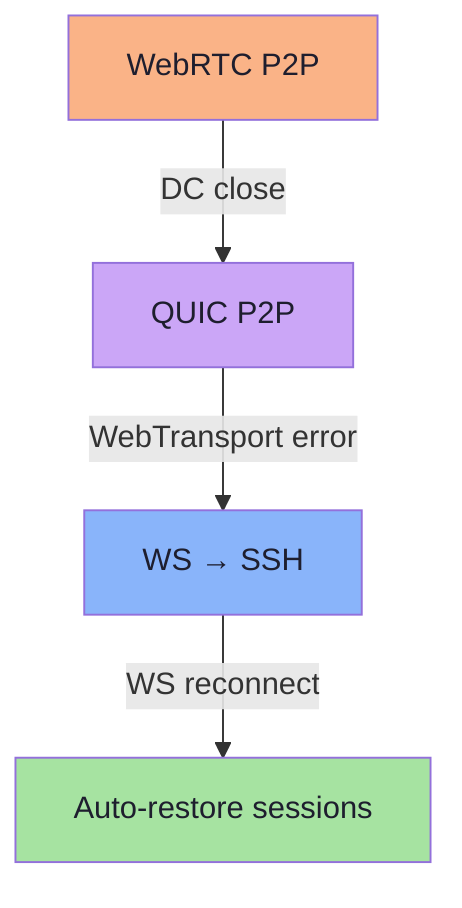

# Architecture

## System Overview

Oxmux provides 5 transport paths for connecting a browser terminal to a remote tmux session. All transports carry the same binary MessagePack protocol.



## Dual-Transport Model

The browser maintains TWO transport layers simultaneously:

| Layer | Transport | Purpose | Always Active |
|-------|-----------|---------|---------------|
| **Control Plane** | WebSocket | Session CRUD, agent management, transport upgrades | Yes |
| **Data Plane** | QUIC P2P or WebRTC P2P | Pane I/O (input, output, resize, subscribe) | Only when P2P active |



## WebRTC P2P Flow (Browser-as-Offerer)

Browser creates the offer (with DataChannel), agent creates the answer. This pattern ensures Chrome generates ICE candidates.



## Multi-Session Architecture

### Qualified Pane IDs

tmux pane IDs (`%0`, `%1`) are only unique per tmux server. Multiple sessions on different hosts share the same IDs. Qualified pane IDs scope them globally:

```
{managedSessionId}::{tmuxPaneId}
e.g., "abc-123::%0"
```

### Per-Session P2P

Each connected session can have its own independent P2P connection:



### Mashed View (NxN Grid)



## Terminal Registry

Prevents duplicate event handlers when switching between single and mashed views:



## Agent Deployment



## Transport Fallback Chain



## tmux Integration

### Control Mode
- `tmux -CC attach -t <session>` via `script -q` for PTY allocation
- `%output <pane_id> <data>` events parsed and broadcast per pane
- `window-size latest` allows resize beyond control mode client's 80x24
- `send-keys -H <hex bytes>` with each byte as separate argument

### Pane Sizing
- Browser: FitAddon calculates cols/rows from container dimensions
- Client sends `{t:'r', pane:'%0', cols:130, rows:30}` on resize
- Agent/server runs `tmux resize-pane -t %0 -x 130 -y 30`
- `SIGWINCH` propagated to shell automatically by tmux
