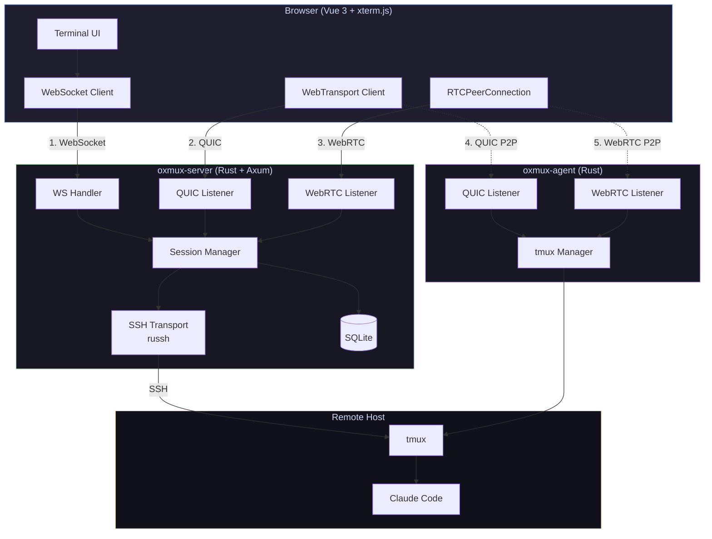
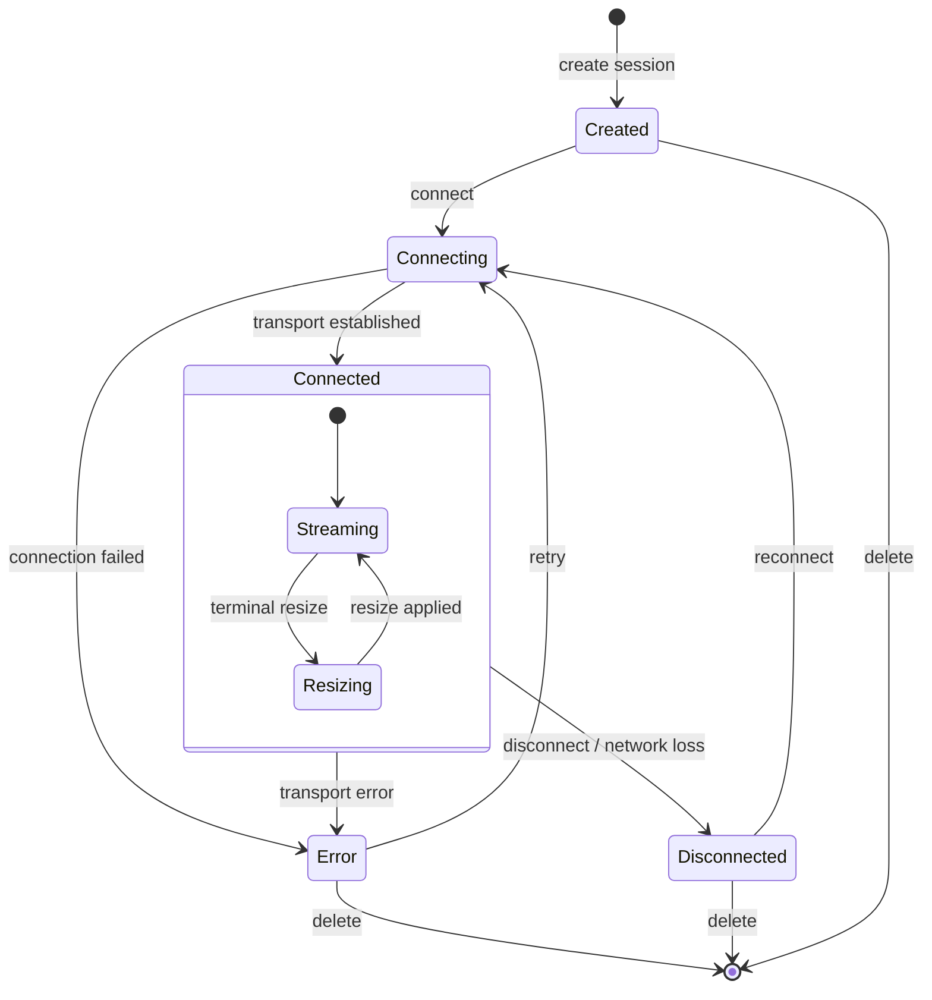
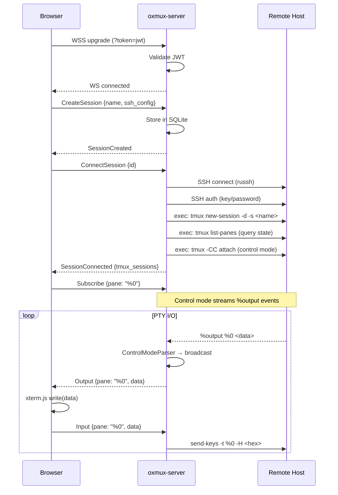
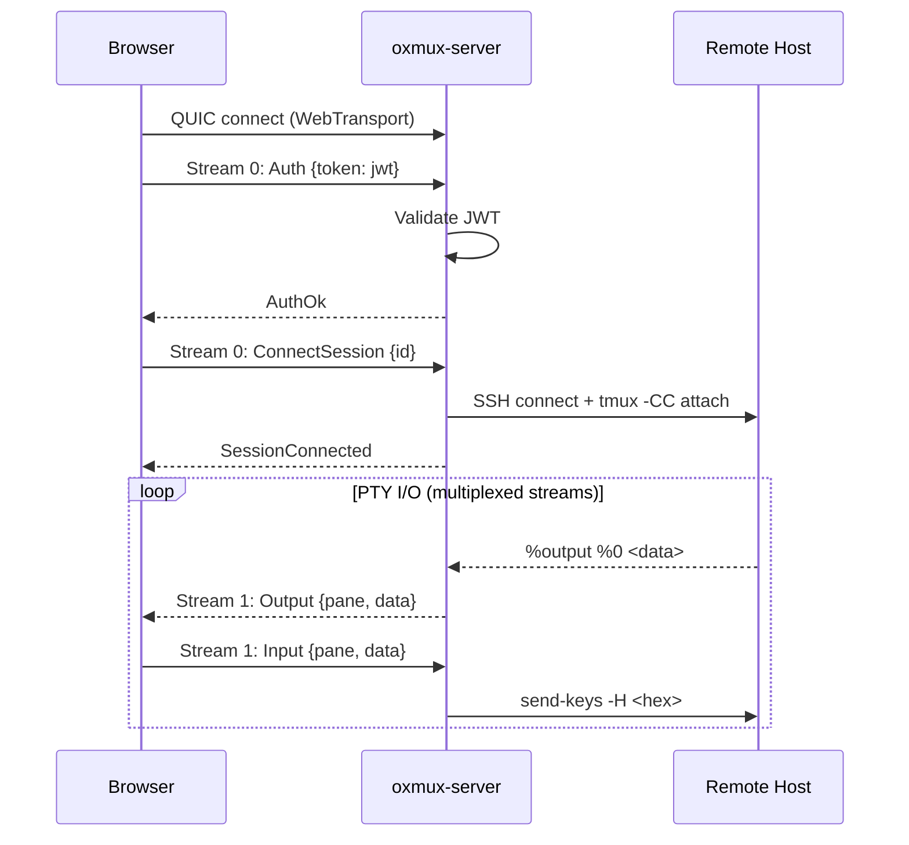
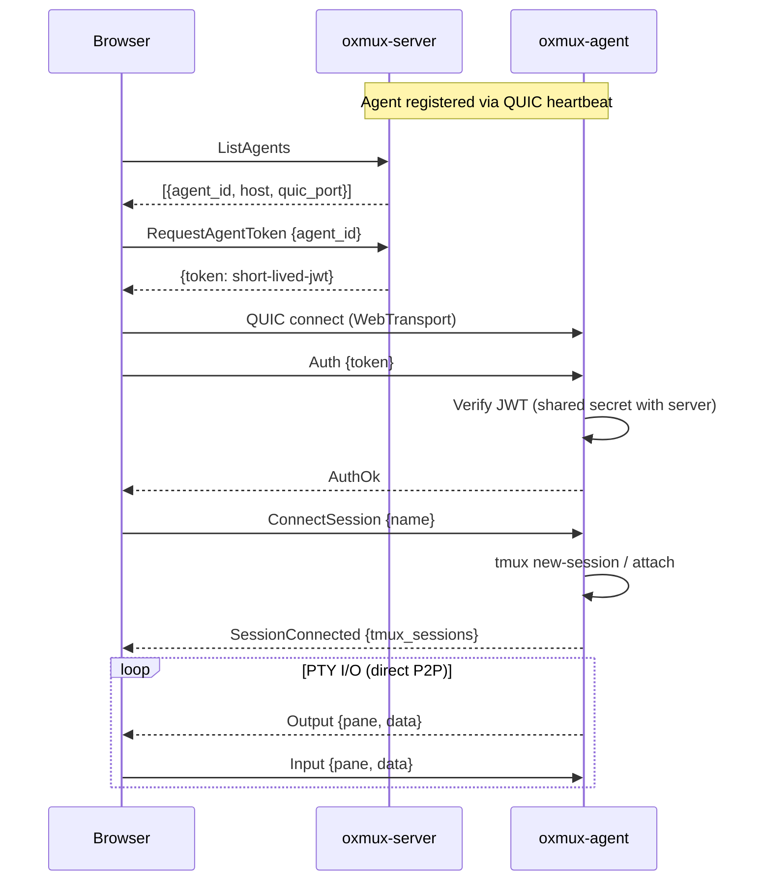
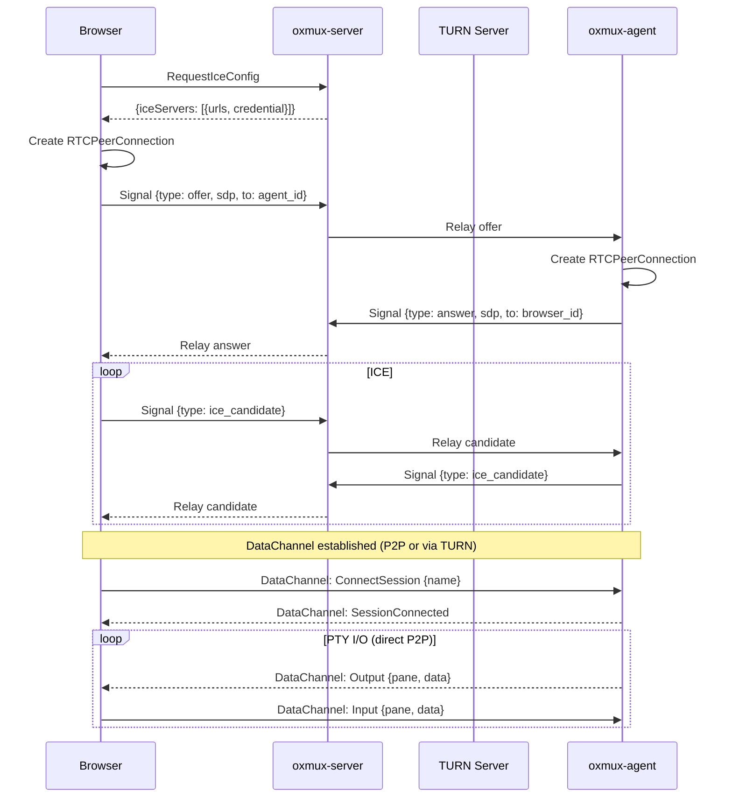
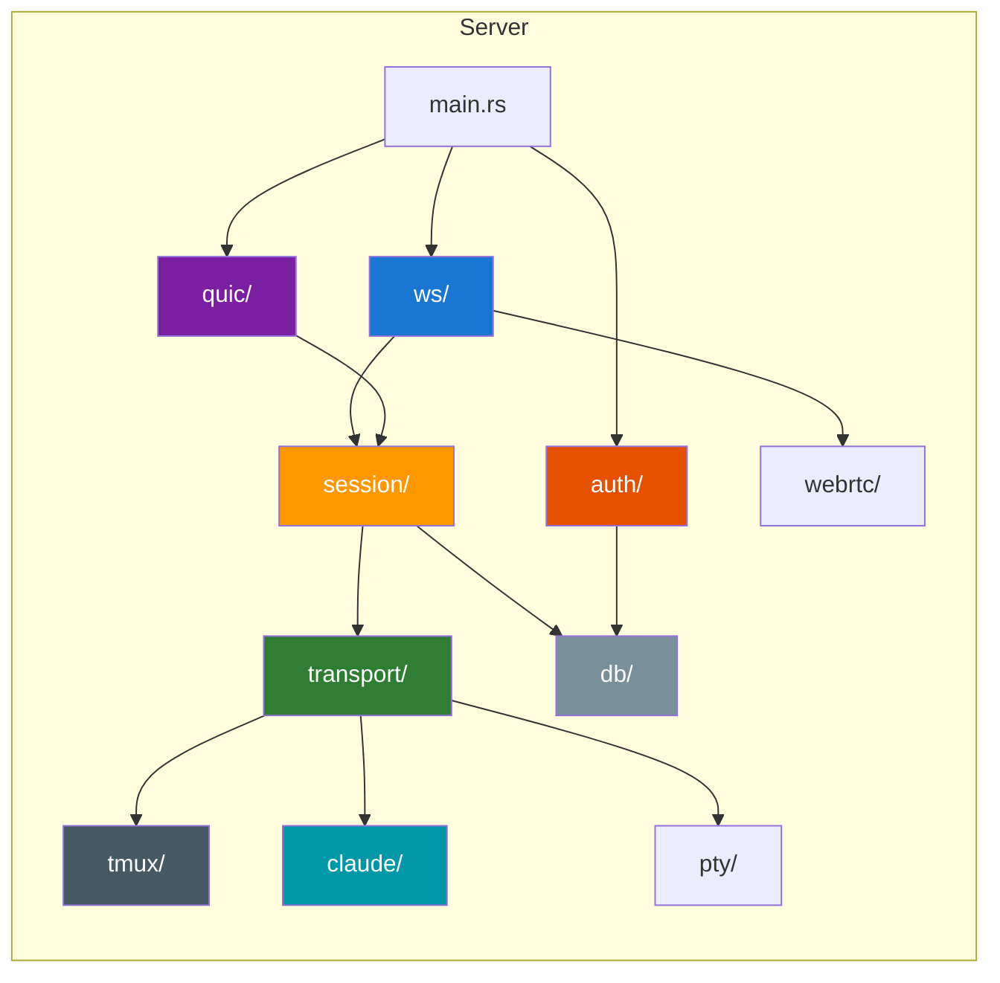
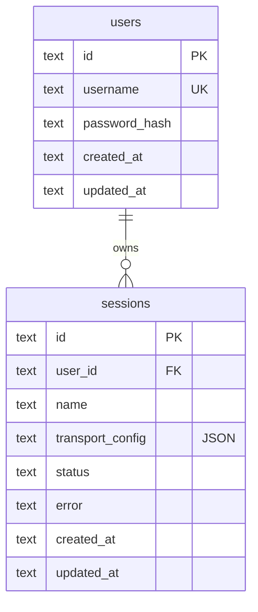
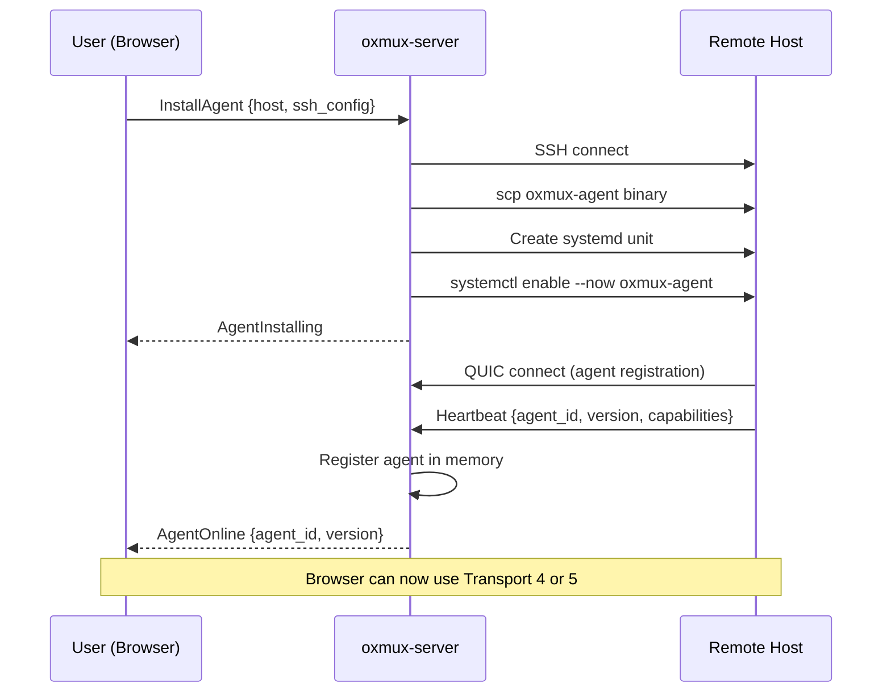

# Architecture

## System Overview

Oxmux provides 5 transport paths for connecting a browser terminal to a remote tmux session. All transports carry the same binary MessagePack protocol.



## Transport Comparison

| # | Name | Data Path | Latency | Requires | Use Case |
|---|------|-----------|---------|----------|----------|
| 1 | WS → SSH | Browser → Server → Host | High | Nothing extra | Default, always works |
| 2 | QUIC → SSH | Browser → Server → Host | Medium | QUIC port on server | Mobile, lossy networks |
| 3 | WebRTC → SSH | Browser → Server → Host | Medium | TURN/STUN | NAT traversal to server |
| 4 | QUIC → Agent | Browser → Agent direct | Low | Agent on host | Best performance |
| 5 | WebRTC → Agent | Browser → Agent direct | Low | Agent + TURN | P2P through any NAT |

## Session Lifecycle



## Transport 1: WebSocket → SSH

The default transport. Browser connects via WSS, server SSHes to the remote host.



## Transport 2: QUIC → SSH

Browser uses WebTransport API for QUIC connection to server. Server SSHes to host.



## Transport 4: QUIC → Agent (P2P)

Browser connects directly to oxmux-agent via QUIC. No server in data path.



## Transport 5: WebRTC → Agent (P2P)

Browser connects directly to agent via WebRTC DataChannel. Server only relays signaling.



## Module Structure



## Database Schema



## Agent Deployment Flow



## tmux Control Mode

The server uses `tmux -CC attach` (control mode) for both state management and PTY I/O streaming:

```
┌─────────────────────────────────────────────┐
│ SSH Channel (persistent)                     │
│                                              │
│ stdin  → tmux commands                       │
│   send-keys -t %0 -H 1b 5b 41              │
│   resize-pane -t %0 -x 120 -y 35           │
│                                              │
│ stdout ← control mode notifications         │
│   %output %0 \033[1;32mhello\033[0m         │
│   %session-changed $0 my-session            │
│   %layout-change @0 ab12,120x35,0,0,0      │
│   %window-add @1                            │
└─────────────────────────────────────────────┘
```

Output bytes are octal-escaped by tmux. The `ControlModeParser` decodes them and broadcasts to per-pane `broadcast::channel`s. Each subscribed browser client receives the same bytes via their chosen transport.
