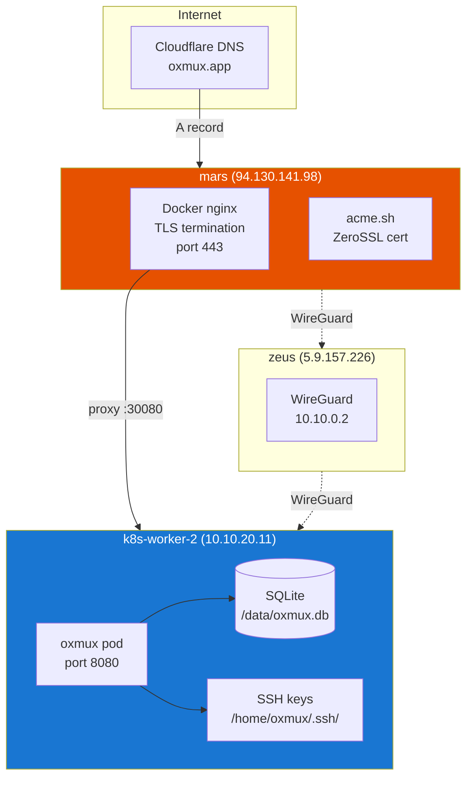

# Deployment

## Infrastructure



## Kubernetes Resources

| Resource | Name | Namespace |
|----------|------|-----------|
| Deployment | `oxmux` | `oxmux` |
| Service (NodePort) | `oxmux` | `oxmux` (HTTP :30080) |
| Service (NodePort) | `oxmux-quic` | `oxmux` (QUIC :30443/UDP) |
| ConfigMap | `oxmux-config` | `oxmux` |
| Secret | `oxmux-secret` | `oxmux` |
| Secret | `ssh-keys` | `oxmux` |
| HPA | `oxmux` | `oxmux` (1-6 replicas) |

## Deploy Scripts

All scripts in `/home/gjovanov/oxmux-deploy/scripts/`:

| Script | Purpose | Requires |
|--------|---------|----------|
| `build-image.sh` | Docker build + scp + containerd import | Docker |
| `deploy.sh` | Apply K8s manifests | kubectl |
| `setup-dns.sh` | Create Cloudflare A record | CF_Token |
| `setup-tls.sh` | Issue Let's Encrypt cert via acme.sh | sudo |
| `setup-nginx.sh` | Configure host nginx vhost | sudo |
| `run-e2e.sh` | Run Playwright E2E tests | npm |

## Quick Deploy

```bash
# First time setup
cd /home/gjovanov/oxmux-deploy
./scripts/setup-dns.sh           # Cloudflare DNS
sudo ./scripts/setup-tls.sh     # TLS certificate
sudo ./scripts/setup-nginx.sh   # nginx reverse proxy

# Build and deploy
./scripts/build-image.sh         # Build Docker image → worker2
./scripts/deploy.sh              # Apply K8s manifests

# Verify
curl -I https://oxmux.app/health
```

## Environment Variables

### ConfigMap (`oxmux-config`)

| Variable | Default | Description |
|----------|---------|-------------|
| `OXMUX_HOST` | `0.0.0.0` | Bind address |
| `OXMUX_PORT` | `8080` | HTTP port |
| `OXMUX_LOG_LEVEL` | `info` | tracing log level |
| `QUIC_LISTEN_PORT` | `4433` | QUIC listener port |
| `QUIC_CERT_PATH` | `/etc/oxmux/tls/tls.crt` | QUIC TLS cert |
| `QUIC_KEY_PATH` | `/etc/oxmux/tls/tls.key` | QUIC TLS key |
| `COTURN_REALM` | `coturn.roomler.live` | TURN realm |
| `COTURN_TTL` | `86400` | TURN credential TTL |
| `COTURN_SERVERS` | `198.51.100.10:3478,...` | TURN servers |
| `COTURN_TLS_SERVERS` | `198.51.100.10:5349,...` | TURNS servers |
| `CLAUDE_DEFAULT_FLAGS` | `--output-format stream-json` | Claude CLI flags |
| `DATABASE_URL` | `sqlite:/data/oxmux.db?mode=rwc` | SQLite path |

### Secret (`oxmux-secret`)

| Variable | Description |
|----------|-------------|
| `OXMUX_JWT_SECRET` | JWT signing secret |
| `COTURN_AUTH_SECRET` | COTURN shared secret for HMAC-SHA1 |

### SSH Keys (`ssh-keys` secret)

Mounted at `/home/oxmux/.ssh/`:

| Key | Format | Description |
|-----|--------|-------------|
| `id_secunet` | OpenSSH ed25519 | Primary key (unencrypted) |
| `id_rsa` | OpenSSH RSA | Legacy RSA key |
| `putty` | PEM RSA (DES-EDE3-CBC) | PuTTY-converted key (needs passphrase) |
| `config` | SSH config | SSH client configuration |
| `known_hosts` | Known hosts | Host key verification |

## Docker Image

Multi-stage build: Rust 1.91 (server) + Node 22 (client) → Debian Trixie slim runtime.

```dockerfile
# Stage 1: Build Rust server
FROM rust:1.91-slim AS server-builder

# Stage 2: Build Vue 3 client
FROM node:22-slim AS client-builder

# Stage 3: Runtime
FROM debian:trixie-slim
# Includes: ca-certificates, tmux, openssh-client, openssl
```

Runtime packages:
- `tmux` — for local transport (dev mode)
- `openssh-client` — for SSH key management
- `openssl` — for DES-EDE3-CBC key conversion

## nginx Configuration

```nginx
server {
    listen 443 ssl http2;
    server_name oxmux.app;

    ssl_certificate /etc/nginx/cert/oxmux.app.pem;
    ssl_certificate_key /etc/nginx/cert/oxmux.app.key;

    location / {
        proxy_pass http://10.10.20.11:30080;
        proxy_http_version 1.1;
        proxy_set_header Upgrade $http_upgrade;
        proxy_set_header Connection "upgrade";
        proxy_read_timeout 3600;  # 1h for WebSocket
    }
}
```

## SSL Certificate

- CA: ZeroSSL (via acme.sh)
- Challenge: Cloudflare DNS-01
- Domains: `oxmux.app`, `*.oxmux.app`
- Auto-renewal: acme.sh cron
- Cert path: `/gjovanov/nginx/cert/oxmux.app.{pem,key}`

## Agent Deployment

See [docs/agent.md](agent.md) for agent installation and management.
