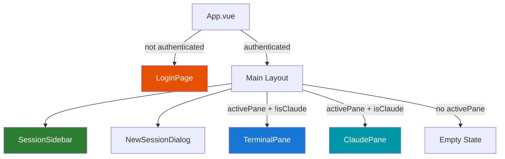
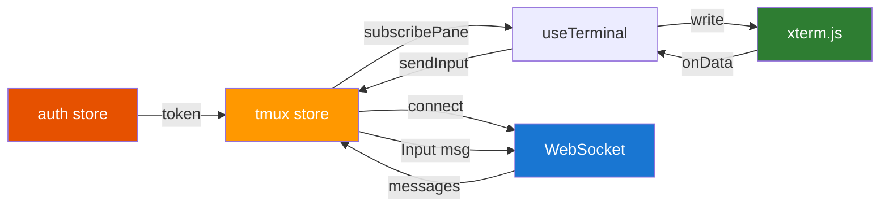

# Frontend Architecture

## Page Map



## Components

| Component | File | Purpose |
|-----------|------|---------|
| `App.vue` | `src/App.vue` | Root layout, auth gate, WS connection |
| `LoginPage.vue` | `src/components/LoginPage.vue` | Login/register form with tab switching |
| `SessionSidebar.vue` | `src/components/SessionSidebar.vue` | Session list, tmux tree, pane selection |
| `NewSessionDialog.vue` | `src/components/NewSessionDialog.vue` | Create session form (transport + SSH config) |
| `TerminalPane.vue` | `src/components/TerminalPane.vue` | xterm.js wrapper for raw PTY output |
| `ClaudePane.vue` | `src/components/ClaudePane.vue` | Structured Claude Code event viewer |
| `ToolUseBlock.vue` | `src/components/ToolUseBlock.vue` | Collapsible tool use block (Read/Write/Bash) |
| `CostMeter.vue` | `src/components/CostMeter.vue` | Real-time session cost display |
| `ContextBar.vue` | `src/components/ContextBar.vue` | Context window usage indicator |

## Pinia Stores



### Auth Store (`stores/auth.ts`)

| State | Type | Description |
|-------|------|-------------|
| `token` | `string \| null` | JWT token (persisted in localStorage) |
| `user` | `User \| null` | Current user info |
| `isAuthenticated` | `computed<boolean>` | Whether token exists |
| `error` | `string \| null` | Last auth error |
| `loading` | `boolean` | Auth request in progress |

| Action | Description |
|--------|-------------|
| `login(username, password)` | POST /api/auth/login |
| `register(username, password)` | POST /api/auth/register |
| `checkAuth()` | GET /api/auth/me (validate stored token) |
| `logout()` | Clear token and user |

### Tmux Store (`stores/tmux.ts`)

| State | Type | Description |
|-------|------|-------------|
| `sessions` | `TmuxSessionInfo[]` | tmux session tree (active session) |
| `managedSessions` | `ManagedSession[]` | All user's persisted sessions |
| `activePane` | `string \| null` | Currently selected pane ID |
| `activeSessionId` | `string \| null` | Currently connected session |
| `connectionStatus` | `string` | WS connection state |
| `claudeSessions` | `Map<string, ClaudeSessionState>` | Claude session accumulators |
| `showNewSessionDialog` | `boolean` | Dialog visibility |

| Action | Description |
|--------|-------------|
| `connect(wsUrl)` | Open WebSocket with JWT token |
| `createSession(name, transport)` | Send `sess_create` |
| `connectSession(id)` | Send `sess_connect` |
| `disconnectSession(id)` | Send `sess_disconnect` |
| `deleteSession(id)` | Send `sess_delete` |
| `refreshSession(id)` | Send `sess_refresh` |
| `subscribePane(id, handler)` | Subscribe to pane output |
| `sendInput(id, data)` | Send keyboard input |
| `sendResize(id, cols, rows)` | Send terminal resize |

## Composables

### `useTerminal(paneId, containerRef)`

Manages xterm.js terminal lifecycle for a pane:
- Creates `Terminal` instance with Catppuccin Mocha theme
- Loads `FitAddon`, `SearchAddon`, `WebLinksAddon`
- Subscribes to pane output via store
- Captures keyboard input and sends to server
- Handles resize via `ResizeObserver`

### `useQuic(url)` (planned)

WebTransport API client for QUIC connections.

### `useWebRtc(iceConfig)` (planned)

RTCPeerConnection + DataChannel setup for WebRTC connections.

## Theme

Catppuccin Mocha color scheme throughout:

| Element | Color | Hex |
|---------|-------|-----|
| Background | Base | `#1e1e2e` |
| Surface | Mantle | `#181825` |
| Overlay | Surface0 | `#313244` |
| Text | Text | `#cdd6f4` |
| Subtext | Subtext0 | `#a6adc8` |
| Blue (primary) | Blue | `#89b4fa` |
| Green (success) | Green | `#a6e3a1` |
| Red (error) | Red | `#f38ba8` |
| Yellow (warning) | Yellow | `#f9e2af` |
| Purple (agent) | Mauve | `#cba6f7` |
| Orange (WebRTC) | Peach | `#fab387` |

## New Session Dialog

Transport selection UI with dynamic fields:

```
┌─────────────────────────────────┐
│ New Session                   × │
├─────────────────────────────────┤
│ Name: [my-project            ]  │
│ Host: [94.130.141.98         ]  │
│ User: [gjovanov              ]  │
│                                 │
│ Transport:                      │
│ ┌─────────────────────────────┐ │
│ │ Server-relayed:             │ │
│ │ ○ WebSocket  ○ QUIC  ○ WRT │ │
│ │ Agent-direct:               │ │
│ │ ○ QUIC P2P   ○ WebRTC P2P  │ │
│ └─────────────────────────────┘ │
│                                 │
│ Auth: [Private Key ▾]           │
│ Key:  [~/.ssh/id_secunet     ]  │
│ Pass: [                      ]  │
│                                 │
│         [Cancel] [Create] [C&C] │
└─────────────────────────────────┘
```
